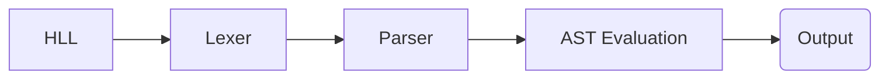
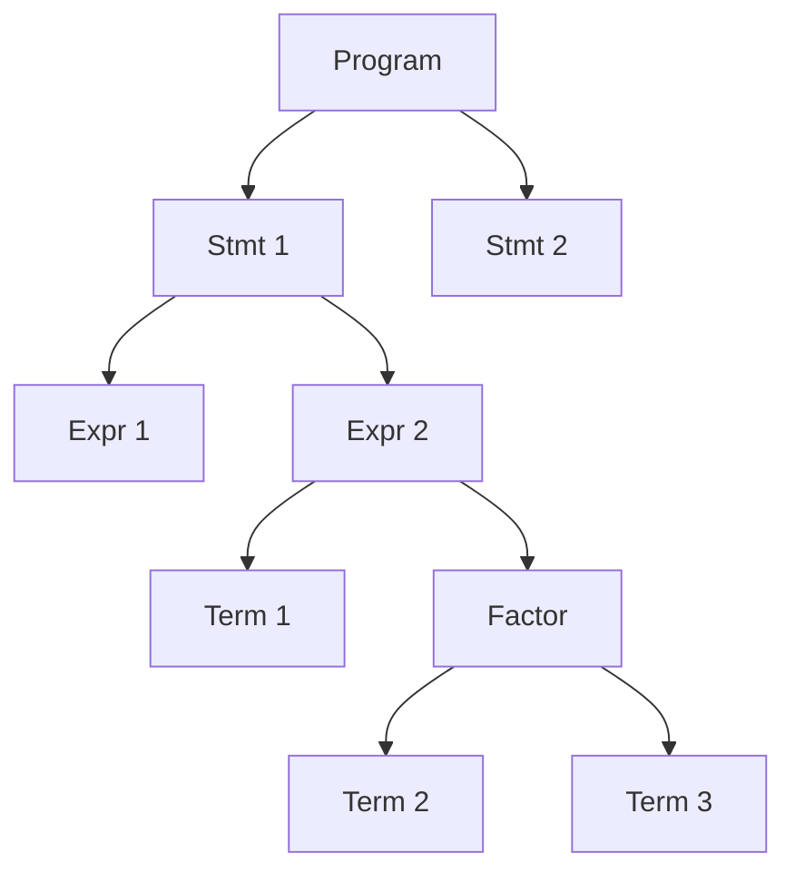
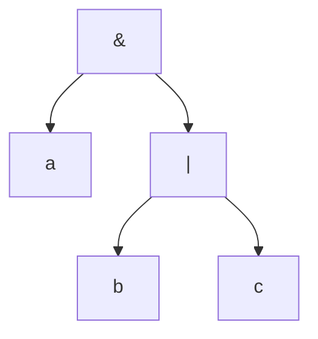

# LogiCode

LogiCode is a scripting language that is designed to be used for boolean algebra and logic circuit design. It is a simple language that is easy to learn and use. The compiler is written in Go which implements a hand-crafted lexer and parser.

## Grammar

Here is an example snippet of what a LogiCode program would look like:

`foo.lc`

```
!Program;

!Declare;
  LET x <- 001;
  LET y <- 010;
  LET z <- 011;
!EndDeclare;

!Begin;
  LET foo <- x AND y;
  LET bar <- NOT z;
  LET baz <- foo OR bar;
  READ baz;
!End;

!EndProgram;
```

This program will output `100` to stdout.

## Architecture

The [`Lexer`](https://en.wikipedia.org/wiki/Lexical_analysis) produces an array of [`Tokens`](https://bits.netbeans.org/11.1/javadoc/org-netbeans-modules-lexer/index.html?org/netbeans/api/lexer/Token.html) from the [HLL](https://en.wikipedia.org/wiki/High-level_programming_language) source code, which are then passed to the [`Parser`](https://en.wikipedia.org/wiki/Parsing). The `Parser` produces an Abstract Syntax Tree ([`AST`](https://en.wikipedia.org/wiki/Abstract_syntax_tree)) which is then passed to the Interpreter. The Interpreter then evaluates the `AST` using evalutation rules and produces an output. Here is a simple diagram that illustrates the architecture:



## Roadmap

-   [x] Lexer Implementation (_Hasn't been thoroughly tested, yet_)
-   [ ] Error Handling Infrastructure across all modules
-   [ ] Parser Implementation
-   [ ] REPL Implementation
-   [ ] Packaging

## Lexer

LogiCode embraces a simple syntax that is easy to learn and use.
Here are some of the soon-to-be Lexable tokens:

| Token Type | Description           | Token Type     | Description           |
| ---------- | --------------------- | -------------- | --------------------- |
| `ASSIGN`   | Assignment operator   | `EOF`          | End of file           |
| `IDENT`    | Identifier            | `DECLARESTART` | Declare start keyword |
| ~~`INT`~~  | ~~Integer~~           | `DECLAREEND`   | Declare end keyword   |
| `SIGN`     | Signal                | `PROGRAMSTART` | Program start keyword |
| `AND`      | BitWise and operator  | `PROGRAMEND`   | Program end keyword   |
| `OR`       | BitWise or operator   | `BEGIN`        | Begin keyword         |
| `XOR`      | BitWise xor operator  | `END`          | End keyword           |
| `NOT`      | BitWise not operator  | `SEMICOLON`    | Semicolon             |
| `NAND`     | BitWise nand operator | `WRITE`        | Write keyword         |
| `NOR`      | BitWise nor operator  | `READ`         | Read keyword          |
| `XNOR`     | BitWise xnor operator | `LET`          | Let keyword           |

> **Note** These are reserved keywords that cannot be used as identifiers.

-   [x] Lex Semicolon (i.e. `TK_SEMICOL`)
-   [x] Lex Signal (i.e. `TK_SIGNAL`)
-   [x] Lex Assignment operator (i.e. `OP_ASSIGN`)
-   [x] Lex Identifier (i.e. `TK_IDENTIFIER`)
-   [x] Handle Empty Files
-   [x] Lex Write keyword (i.e. `TK_WRITE`)
-   [x] Lex Read keyword (i.e. `TK_READ`)
-   [x] Lex Entry Point delimiters (i.e. `TK_BEGIN` and `TK_END`)
-   [x] Lex Let keyword (i.e. `TK_LET`)
-   [x] Lex Declare delimiters (i.e. `TK_DECLARESTART` and `TK_DECLAREEND`)
-   [x] Lex Program delimiters (i.e. `TK_PROGRAMSTART` and `TK_PROGRAMEND`)
-   [x] Lex BitWise and operator (i.e. `OP_AND`)
-   [x] Lex BitWise or operator (i.e. `OP_OR`)
-   [x] Lex BitWise xor operator (i.e. `OP_XOR`)
-   [x] Lex BitWise not operator (i.e. `OP_NOT`)
-   [x] Lex BitWise nand operator (i.e. `OP_NAND`)
-   [x] Lex BitWise nor operator (i.e. `OP_NOR`)
-   [x] Lex BitWise xnor operator (i.e. `OP_XNOR`)
-   [ ] Lex Comments (i.e `--`) (Filter out)

> **Note** The lexer is implemented using a hand-crafted lexer. It is not generated by a lexer generator. Eventually I would like to migrate from the the key-per-key string streaming approach to a buffer scanning approach.

## Parser

The `Parser` is a recursive descent parser that produces an `AST` from the `Tokens` that are produced by the `Lexer`.

## AST

The `AST` is a tree data structure that represents the source code. It is used to evaluate the source code in a recursive manner which
is defined by the grammar of the language. This approach makes it trivial to respect operator precedence and associativity. Here is a simple diagram that illustrates the `AST`:



Here is a simple example of the `AST` representation of an expression:

Expression: `a & b | c`



> **Warning** The `AST` is not a binary tree. It is a tree data structure that can have any number of children.
